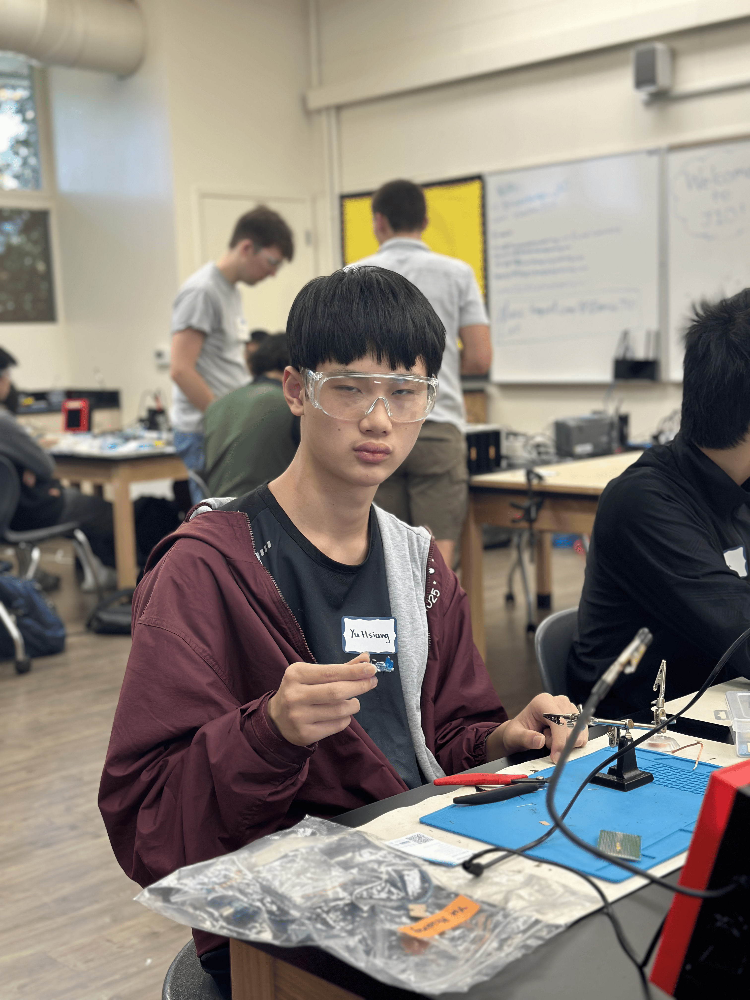

The Automatic Cat Laser is an embedded systems project that combines electronics, programming, and mechanical design to create an autonomous pet enrichment device. Using an Arduino Nano, dual servo motors, and a laser module, the system generates dynamic movement patterns that encourage cats to stay active and engaged without requiring constant human interaction. Throughout the project, I developed skills in hardware integration, motion control, and microcontroller programming while overcoming challenges related to reliability, precision, and system coordination. The result is a practical engineering solution that demonstrates how technology can be used to improve the well-being of household pets.

| **Engineer** | **School** | **Area of Interest** | **Grade** |
|:--:|:--:|:--:|:--:|
| Yu Hsiang K. | Piedmont Hills High School | Electrical Engineering | Incoming Junior





# Second Milestone

<iframe width="560" height="315" src="https://www.youtube.com/embed/CkGeqMq0fFI?si=y9yLU56fsKTDfR8L" title="YouTube video player" frameborder="0" allow="accelerometer; autoplay; clipboard-write; encrypted-media; gyroscope; picture-in-picture; web-share" referrerpolicy="strict-origin-when-cross-origin" allowfullscreen></iframe>

For this milestone, I programmed and inputed the code for the automatic cat laser system. I programmed the microcontroller to host its own local Wi-Fi hotspot, allowing any compatible device to connect to its network. Once connected, users can go to a dedicated webpage where they can control the laser's movements in real time using the arrow keys. The most significant challenge during this milestone was developing and debugging the web interface itself. Ensuring smooth communication between the webpage inputs and the hardware took several hours of troubleshooting, but it ultimately provided a highly responsive and reliable control system.

# First Milestone

<iframe width="560" height="315" src="https://www.youtube.com/embed/ur3kb19ppF0?si=G0V7BEATicOukPQH" title="YouTube video player" frameborder="0" allow="accelerometer; autoplay; clipboard-write; encrypted-media; gyroscope; picture-in-picture; web-share" referrerpolicy="strict-origin-when-cross-origin" allowfullscreen></iframe>

For this milestone, I assembled the automatic cat laser system by completing the placement and wiring of all the main hardware components. This included mounting the microcontroller, attaching both servo motors, and installing the laser module onto the moving servo platform so that it could aim in different directions. After assembling the mechanical parts, I  connected each component to the microcontroller using a breadboard, making sure the power, ground, and signal wires were connected correctly. Once everything was wired together, I tested the connections to verify that the servos responded properly and that the laser module functioned as expected. One of the biggest challenges I faced during this milestone was learning how to wire the circuit correctly. When I first started the project, I had little to no experience using a breadboard. Because of this, I keep misplacing the components and wires. To overcome this challenge, I asked the BlueStamp staff for guidance. They explained how the rows and columns of a breadboard are connected and showed me how to organize my wiring to avoid mistakes. After practicing and making several adjustments, I became much more comfortable using a breadboard and was able to wire the entire circuit on my own. This experience not only allowed me to complete the milestone successfully but also gave me a much stronger understanding of basic electronics and circuit assembly, which will be valuable for the remaining stages of the project.


# Starter Milestone

<iframe width="560" height="315" src="https://www.youtube.com/embed/_HzAo9UWYic?si=_cvSKKm2nqlFV-xG" title="YouTube video player" frameborder="0" allow="accelerometer; autoplay; clipboard-write; encrypted-media; gyroscope; picture-in-picture; web-share" referrerpolicy="strict-origin-when-cross-origin" allowfullscreen></iframe>

For my starter milestone, I chose to do the Weevil Eye, which is an little device that will glow in the dark. One challenge I faced while making this project is that I didn't know where to solder the different components and I needed help from the staff, after the staff told me where to solder the different components the project was pretty easy.

# Schematics 
.png)

# Code
```c++
#include <WiFi.h>
#include <WebServer.h>
#include <Servo.h>

const char* ssid = "LaserBot";
const char* password = "12345678";

WebServer server(80);

Servo servo6;  // up/down (Y)
Servo servo9;  // left/right (X)

int angle6 = 90;
int angle9 = 90;

bool up = false;
bool down = false;
bool left = false;
bool right = false;

bool absoluteMode = false; 
bool laserOn = true;

// =====================
// ABSOLUTE XY CONTROL
// =====================
void setXY(int y, int x) {
  absoluteMode = true;

  // Convert -90..90 → 0..180 servo range
  angle6 = constrain(90 + y, 0, 180);
  angle9 = constrain(90 + x, 0, 180);

  servo6.write(angle6);
  servo9.write(angle9);
}

void setup() {
  Serial.begin(115200);

  servo6.attach(6);
  servo9.attach(9);

  servo6.write(angle6);
  servo9.write(angle9);

  pinMode(3, OUTPUT);
  digitalWrite(3, HIGH);

  WiFi.softAP(ssid, password);
  Serial.println(WiFi.softAPIP());

  // =====================
  // MAIN PAGE
  // =====================
  server.on("/", []() {
    server.send(200, "text/html", R"rawliteral(
<!DOCTYPE html>
<html>
<head>
  <title>Laser Controller</title>
  <style>
    body {
      background: #111;
      color: white;
      font-family: Arial, sans-serif;
      text-align: center;
      user-select: none;
    }
    h2 { margin-top: 20px; }
    .pad {
      display: grid;
      grid-template-columns: 100px 100px 100px;
      grid-template-rows: 100px 100px 100px;
      justify-content: center;
      margin-top: 40px;
      gap: 10px;
    }
    button {
      width: 90px;
      height: 90px;
      font-size: 16px;
      border-radius: 12px;
      border: 2px solid #333;
      background: #222;
      color: white;
      transition: 0.1s;
    }
    button:active {
      background: #333;
    }
    #status {
      margin-top: 20px;
      font-size: 18px;
      color: #00ff99;
    }
    #laserBtn {
      width: 120px;
      height: 45px;
      margin-top: 15px;
      margin-bottom: 15px;
      font-size: 16px;
      background: #aa0000;
    }
  </style>
</head>
<body>

<h2>Laser Control Panel</h2>
<div id="status">Idle</div>

<button id="laserBtn" onclick="toggleLaser()">
  LASER
</button>

<div class="pad">
  <div></div>
  <button id="upBtn"
    onmousedown="upOn()" onmouseup="upOff()"
    ontouchstart="upOn()" ontouchend="upOff()">
    UP
  </button>
  <div></div>

  <button id="leftBtn"
    onmousedown="leftOn()" onmouseup="leftOff()"
    ontouchstart="leftOn()" ontouchend="leftOff()">
    LEFT
  </button>
  <div></div>
  <button id="rightBtn"
    onmousedown="rightOn()" onmouseup="rightOff()"
    ontouchstart="rightOn()" ontouchend="rightOff()">
    RIGHT
  </button>

  <div></div>
  <button id="downBtn"
    onmousedown="downOn()" onmouseup="downOff()"
    ontouchstart="downOn()" ontouchend="downOff()">
    DOWN
  </button>
  <div></div>
</div>

<script>
let statusDiv = document.getElementById("status");
let laserBtn = document.getElementById("laserBtn");

function press(text) {
  statusDiv.innerText = text;
}

function release() {
  statusDiv.innerText = "Idle";
}

/* ===== BUTTON CONTROL ===== */
function upOn() { fetch('/up/on'); press("Moving Up"); }
function upOff() { fetch('/up/off'); release(); }

function downOn() { fetch('/down/on'); press("Moving Down"); }
function downOff() { fetch('/down/off'); release(); }

function leftOn() { fetch('/left/on'); press("Moving Left"); }
function leftOff() { fetch('/left/off'); release(); }

function rightOn() { fetch('/right/on'); press("Moving Right"); }
function rightOff() { fetch('/right/off'); release(); }

function toggleLaser() { 
  fetch('/laser/toggle')
    .then(response => response.text())
    .then(state => {
      laserBtn.style.background = (state === "on") ? "#aa0000" : "#222";
    });
}

/* ===== KEYBOARD ===== */
document.addEventListener('keydown', (e) => {
  if (e.repeat) return;

  switch (e.key.toLowerCase()) {
    case 'w':
    case 'arrowup': upOn(); break;
    case 's':
    case 'arrowdown': downOn(); break;
    case 'a':
    case 'arrowleft': leftOn(); break;
    case 'd':
    case 'arrowright': rightOn(); break;
    case 'e': toggleLaser(); break; 
  }
});

document.addEventListener('keyup', (e) => {
  switch (e.key.toLowerCase()) {
    case 'w':
    case 'arrowup': upOff(); break;
    case 's':
    case 'arrowdown': downOff(); break;
    case 'a':
    case 'arrowleft': leftOff(); break;
    case 'd':
    case 'arrowright': rightOff(); break;
  }
});
</script>

</body>
</html>
)rawliteral");
  });

  // =====================
  // BUTTON ROUTES
  // =====================
  server.on("/up/on", [](){ up = true; absoluteMode = false; server.send(200, "text/plain", "ok"); });
  server.on("/up/off", [](){ up = false; server.send(200, "text/plain", "ok"); });

  server.on("/down/on", [](){ down = true; absoluteMode = false; server.send(200, "text/plain", "ok"); });
  server.on("/down/off", [](){ down = false; server.send(200, "text/plain", "ok"); });

  server.on("/left/on", [](){ left = true; absoluteMode = false; server.send(200, "text/plain", "ok"); });
  server.on("/left/off", [](){ left = false; server.send(200, "text/plain", "ok"); });

  server.on("/right/on", [](){ right = true; absoluteMode = false; server.send(200, "text/plain", "ok"); });
  server.on("/right/off", [](){ right = false; server.send(200, "text/plain", "ok"); });

  server.on("/laser/toggle", []() {
    laserOn = !laserOn;
    digitalWrite(3, laserOn ? HIGH : LOW);
    server.send(200, "text/plain", laserOn ? "on" : "off");
  });

  // =====================
  // ABSOLUTE CONTROL API
  // =====================
  server.on("/set", []() {
    if (server.hasArg("y") && server.hasArg("x")) {
      int y = server.arg("y").toInt(); 
      int x = server.arg("x").toInt(); 

      y = constrain(y, -90, 90);
      x = constrain(x, -90, 90);

      setXY(y, x);
      server.send(200, "text/plain", "ok");
    } else {
      server.send(400, "text/plain", "missing args");
    }
  });

  server.begin();
}

void loop() {
  server.handleClient();
  const int stepSize = 1;

  if (!absoluteMode) {
    if (up) angle6 += stepSize;
    if (down) angle6 -= stepSize;
    if (left) angle9 += stepSize;
    if (right) angle9 -= stepSize;

    angle6 = constrain(angle6, 0, 180);
    angle9 = constrain(angle9, 0, 180);
  }

  servo6.write(angle6);
  servo9.write(angle9);

  delay(10);
}
```

# Bill of Materials
Here's where you'll list the parts in your project. To add more rows, just copy and paste the example rows below.
Don't forget to place the link of where to buy each component inside the quotation marks in the corresponding row after href =. Follow the guide [here]([url](https://www.markdownguide.org/extended-syntax/)) to learn how to customize this to your project needs. 

| **Part** | **Note** | **Price** | **Link** |
|:--:|:--:|:--:|:--:|
| Laser Diode | Used for the laser part of the automatic cat laser. | $6.99 | <a href="https://www.amazon.com/HiLetgo-KY-008-Transmitter-Module-Arduino/dp/B01I1J12JO"> Link </a> |
| Servo Motor | Used for the automatic part of the automatic cat laser, it is coded to spin randomly. | $5.99 | <a href="https://www.amazon.com/WWZMDiB-SG90-Control-Servos-Arduino/dp/B0BKPL2Y21/ref=sr_1_6?crid=1S0ULDPMYL289&dib=eyJ2IjoiMSJ9.MVOp3uTW8X144WJ_CqYOeUurdvj8MGFHhgFJWhnJQ_PZQF5y3uoXozhsr8pvSj294FCgsZ4M7sJ9m8fOxK_rXb5w2ptIu1embqfRb-XiFh0kGi4pSOMHesr-Z0RvyYZyJE86wsMKcQpTrGqzZy00KEviC2-mjqwJff-_E_cuPe6WD8bxMzBXyidjhkfNfCHWgpziThQ-yQkWmyjNPkAQaW2KgmYELwrh9ZVFpGjUgvFf8Zs73zftedxQVR1xTtQMCGap0_LoJG1pK9fXz9kdnLYlASX9SGTarmUXflslpZ8.-PScIyXu3puOojs-MSwJe7EWFAgkg3AnZIQ9gsWJ0Fc&dib_tag=se&keywords=micro%2Bservo%2Bmotor&qid=1782404771&sprefix=servo%2Bmotor%2Caps%2C490&sr=8-6&th=1"> Link </a> |
| Arduino Nano ESP32 | Used for powering the motor and lasers for the automatic cat laser | $18.30 | <a href="https://store-usa.arduino.cc/products/nano-esp32?srsltid=AfmBOopjSqYJPDQ5EN4QlwmA8zYscD2VXAnenzN8x4MRyN9mMpmVnUZM"> Link </a> |
| Breadboard | The Breadboard is used for connecting the different components and powering them through the Arduino | $6.94 | <a href="https://www.circuitspecialists.com/solderless-breadboard-wb-102?srsltid=AfmBOoqAdRa26hUczgJqRGVDgQlZRbzPE5B9W7al7v9-UfMLZbwAIrzp"> Link </a> |
| Male to Male Breadboard Wires | These wires are used to connect the servo motors onto the breadboard and connecting the arduino to the breadboard. | $6.99 | <a href="https://www.amazon.com/ELEGOO-Solderless-Flexible-Breadboard-Compatible/dp/B09ZQP9LB6"> Link </a> |
| Male to Female Breadboard Wires | These wires are used to connect the laser diode onto the breadboard. | $6.99 | <a href="https://www.amazon.com/Solderless-Multicolored-Electronic-Breadboard-Protoboard/dp/B09FPDNHLL/ref=sr_1_2_sspa?dib=eyJ2IjoiMSJ9.QGbaFF62mgZ1Tf0J7CajkMLozJc0dshFcrmAmcYlRqTXcG5xDgYK6kv910gD3F_hxe5aIKEfvtDkKUE4fJjdmwOiAnwRCkElgrZf4M-QGi-XnXF-X4WMBlrW1xhhagWxdfidBzI0Of6DhoHMRr0JYx7rh0vIeTH0_6Hybvec3ppmboCrUr4V4GjC3oInxoDH2XWnIV9MA6UDjIGBA0f-8qCCcq0sQJFP1mN5YjqRAuo.xfJPVOtLCcKQnacooVHHPLJ_gKTuzJmk32kt6164KiA&dib_tag=se&keywords=male+to+female+jumper+wires&qid=1782748237&sr=8-2-spons&sp_csd=d2lkZ2V0TmFtZT1zcF9hdGY&psc=1"> Link </a> |
| Toggle Switch (Optional) | Turn off the laser and servo | $8.98 | <a href="https://www.amazon.com/RLECS-10-Pack-Rocker-Switch-Toggle/dp/B07YDBM7W4"> Link </a> |

# Other Resources
- <a href="https://hackaday.io/project/175107-arduino-cat-laser-toy-diy"> Original Project </a>
- <a href="https://randomnerdtutorials.com/esp32-web-server-arduino-ide/"> Web Server Tutorial </a>
