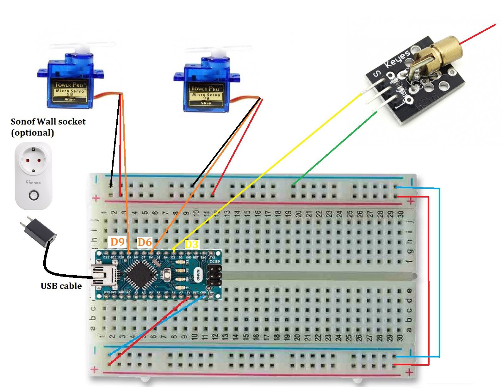

The Automatic Cat Laser is an embedded systems project that combines electronics, programming, and mechanical design to create an autonomous pet enrichment device. Using an Arduino Nano, dual servo motors, and a laser module, the system generates dynamic movement patterns that encourage cats to stay active and engaged without requiring constant human interaction. Throughout the project, I developed skills in hardware integration, motion control, and microcontroller programming while overcoming challenges related to reliability, precision, and system coordination. The result is a practical engineering solution that demonstrates how technology can be used to improve the well-being of household pets.
You should comment out all portions of your portfolio that you have not completed yet, as well as any instructions:
```HTML 
<!--- This is an HTML comment in Markdown -->
<!--- Anything between these symbols will not render on the published site -->
```

| **Engineer** | **School** | **Area of Interest** | **Grade** |
|:--:|:--:|:--:|:--:|
| Yu Hsiang K. | Piedmont Hills High School | Electrical Engineering | Incoming Junior

**Replace the BlueStamp logo below with an image of yourself and your completed project. Follow the guide [here](https://tomcam.github.io/least-github-pages/adding-images-github-pages-site.html) if you need help.**


  
# Final Milestone

**Don't forget to replace the text below with the embedding for your milestone video. Go to Youtube, click Share -> Embed, and copy and paste the code to replace what's below.**

<iframe width="560" height="315" src="https://www.youtube.com/embed/F7M7imOVGug" title="YouTube video player" frameborder="0" allow="accelerometer; autoplay; clipboard-write; encrypted-media; gyroscope; picture-in-picture; web-share" allowfullscreen></iframe>

For your final milestone, explain the outcome of your project. Key details to include are:
- What you've accomplished since your previous milestone
- What your biggest challenges and triumphs were at BSE
- A summary of key topics you learned about
- What you hope to learn in the future after everything you've learned at BSE


# Second Milestone

**Don't forget to replace the text below with the embedding for your milestone video. Go to Youtube, click Share -> Embed, and copy and paste the code to replace what's below.**

<iframe width="560" height="315" src="https://www.youtube.com/embed/y3VAmNlER5Y" title="YouTube video player" frameborder="0" allow="accelerometer; autoplay; clipboard-write; encrypted-media; gyroscope; picture-in-picture; web-share" allowfullscreen></iframe>

For your second milestone, explain what you've worked on since your previous milestone. You can highlight:
- Technical details of what you've accomplished and how they contribute to the final goal
- What has been surprising about the project so far
- Previous challenges you faced that you overcame
- What needs to be completed before your final milestone 

# First Milestone

**Don't forget to replace the text below with the embedding for your milestone video. Go to Youtube, click Share -> Embed, and copy and paste the code to replace what's below.**

<iframe width="560" height="315" src="https://www.youtube.com/embed/ur3kb19ppF0?si=G0V7BEATicOukPQH" title="YouTube video player" frameborder="0" allow="accelerometer; autoplay; clipboard-write; encrypted-media; gyroscope; picture-in-picture; web-share" referrerpolicy="strict-origin-when-cross-origin" allowfullscreen></iframe>

For your first milestone, describe what your project is and how you plan to build it. You can include:
- An explanation about the different components of your project and how they will all integrate together
- Technical progress you've made so far
- Challenges you're facing and solving in your future milestones
- What your plan is to complete your project
For this milestone, I assembled the automatic cat laser system by finishing the placement and wiring of all main components. This included securely mounting the microcontroller, attaching both servo motors, and installing the laser module onto the moving servo platform. After assembling the parts, I wired the components to the microcontroller, power, and ground. One challenge I faced was wiring, because when I first began the project, I had little to no knowledge of how to use a breadboard. As a result, I had to ask the BlueStamp staff for help, and I was able to figure out how breadboard wiring works.


# Starter Milestone

<iframe width="560" height="315" src="https://www.youtube.com/embed/_HzAo9UWYic?si=_cvSKKm2nqlFV-xG" title="YouTube video player" frameborder="0" allow="accelerometer; autoplay; clipboard-write; encrypted-media; gyroscope; picture-in-picture; web-share" referrerpolicy="strict-origin-when-cross-origin" allowfullscreen></iframe>

# Schematics 


# Code
```c++
#include <WiFi.h>
#include <WebServer.h>
#include <Servo.h>

const char* ssid = "LaserBot";
const char* password = "12345678";

WebServer server(80);

Servo servo6;  // up/down
Servo servo9;  // left/right

int angle6 = 90;
int angle9 = 90;

bool up = false;
bool down = false;
bool left = false;
bool right = false;

void setup() {
  Serial.begin(115200);

  servo6.attach(6);
  servo9.attach(9);

  servo6.write(angle6);
  servo9.write(angle9);

  pinMode(3, OUTPUT);
  digitalWrite(3, HIGH);

  WiFi.softAP(ssid, password);
  Serial.println(WiFi.softAPIP());

  server.on("/", []() {
    server.send(200, "text/html", R"rawliteral(
<!DOCTYPE html>
<html>
<head>
  <title>Laser Control</title>
</head>
<body>
<h2>Hold WASD or Arrow Keys</h2>

<script>
document.addEventListener('keydown', (e) => {
  if (e.repeat) return;

  switch (e.key) {

    // INVERTED WASD + ARROWS
    case 'w':
    case 'ArrowUp':
      fetch('/down/on');
      break;

    case 's':
    case 'ArrowDown':
      fetch('/up/on');
      break;

    case 'a':
    case 'ArrowLeft':
      fetch('/right/on');
      break;

    case 'd':
    case 'ArrowRight':
      fetch('/left/on');
      break;
  }
});

document.addEventListener('keyup', (e) => {
  switch (e.key) {

    case 'w':
    case 'ArrowUp':
      fetch('/down/off');
      break;

    case 's':
    case 'ArrowDown':
      fetch('/up/off');
      break;

    case 'a':
    case 'ArrowLeft':
      fetch('/right/off');
      break;

    case 'd':
    case 'ArrowRight':
      fetch('/left/off');
      break;
  }
});
</script>

</body>
</html>
)rawliteral");
  });

  // ON/OFF routes
  server.on("/up/on", [](){ up = true; server.send(200, "text/plain", "ok"); });
  server.on("/up/off", [](){ up = false; server.send(200, "text/plain", "ok"); });

  server.on("/down/on", [](){ down = true; server.send(200, "text/plain", "ok"); });
  server.on("/down/off", [](){ down = false; server.send(200, "text/plain", "ok"); });

  server.on("/left/on", [](){ left = true; server.send(200, "text/plain", "ok"); });
  server.on("/left/off", [](){ left = false; server.send(200, "text/plain", "ok"); });

  server.on("/right/on", [](){ right = true; server.send(200, "text/plain", "ok"); });
  server.on("/right/off", [](){ right = false; server.send(200, "text/plain", "ok"); });

  server.begin();
}

void loop() {
  server.handleClient();

  const int stepSize = 1;

  if (up) angle6 -= stepSize;
  if (down) angle6 += stepSize;
  if (left) angle9 -= stepSize;
  if (right) angle9 += stepSize;

  angle6 = constrain(angle6, 0, 180);
  angle9 = constrain(angle9, 0, 180);

  servo6.write(angle6);
  servo9.write(angle9);

  delay(10);
}

```

# Bill of Materials
Here's where you'll list the parts in your project. To add more rows, just copy and paste the example rows below.
Don't forget to place the link of where to buy each component inside the quotation marks in the corresponding row after href =. Follow the guide [here]([url](https://www.markdownguide.org/extended-syntax/)) to learn how to customize this to your project needs. 

| **Part** | **Note** | **Price** | **Link** |
|:--:|:--:|:--:|:--:|
| Laser Diode | Used for the laser part of the automatic cat laser. | $6.99 | <a href="https://www.amazon.com/HiLetgo-KY-008-Transmitter-Module-Arduino/dp/B01I1J12JO"> Link </a> |
| Servo Motor | Used for the automatic part of the automatic cat laser, it is coded to spin randomly. | $5.99 | <a href="https://www.amazon.com/WWZMDiB-SG90-Control-Servos-Arduino/dp/B0BKPL2Y21/ref=sr_1_6?crid=1S0ULDPMYL289&dib=eyJ2IjoiMSJ9.MVOp3uTW8X144WJ_CqYOeUurdvj8MGFHhgFJWhnJQ_PZQF5y3uoXozhsr8pvSj294FCgsZ4M7sJ9m8fOxK_rXb5w2ptIu1embqfRb-XiFh0kGi4pSOMHesr-Z0RvyYZyJE86wsMKcQpTrGqzZy00KEviC2-mjqwJff-_E_cuPe6WD8bxMzBXyidjhkfNfCHWgpziThQ-yQkWmyjNPkAQaW2KgmYELwrh9ZVFpGjUgvFf8Zs73zftedxQVR1xTtQMCGap0_LoJG1pK9fXz9kdnLYlASX9SGTarmUXflslpZ8.-PScIyXu3puOojs-MSwJe7EWFAgkg3AnZIQ9gsWJ0Fc&dib_tag=se&keywords=micro%2Bservo%2Bmotor&qid=1782404771&sprefix=servo%2Bmotor%2Caps%2C490&sr=8-6&th=1"> Link </a> |
| Arduino Nano ESP32 | Used for powering the motor and lasers for the automatic cat laser | $18.30 | <a href="https://store-usa.arduino.cc/products/nano-esp32?srsltid=AfmBOopjSqYJPDQ5EN4QlwmA8zYscD2VXAnenzN8x4MRyN9mMpmVnUZM"> Link </a> |
| Breadboard | The Breadboard is used for connecting the different components and powering them through the Arduino | $6.94 | <a href="https://www.circuitspecialists.com/solderless-breadboard-wb-102?srsltid=AfmBOoqAdRa26hUczgJqRGVDgQlZRbzPE5B9W7al7v9-UfMLZbwAIrzp"> Link </a> |

# Other Resources/Examples
One of the best parts about Github is that you can view how other people set up their own work. Here are some past BSE portfolios that are awesome examples. You can view how they set up their portfolio, and you can view their index.md files to understand how they implemented different portfolio components.
- [Example 1](https://trashytuber.github.io/YimingJiaBlueStamp/)
- [Example 2](https://sviatil0.github.io/Sviatoslav_BSE/)
- [Example 3](https://arneshkumar.github.io/arneshbluestamp/)

To watch the BSE tutorial on how to create a portfolio, click here.
